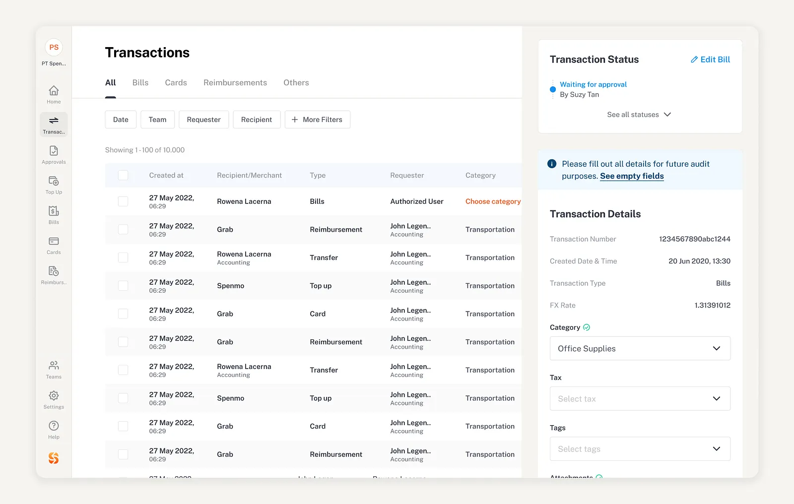

# Transactions Page Refactor

## Requirements

1. Read `AGENTS.md` before making any changes.
2. Refactor the Transactions page only.
3. Use the **shadcn/ui Table** component.
4. The table must contain exactly these columns:
   - Transaction ID
   - Transaction Name
   - Date Created
   - Type
   - Amount
   - Action
5. Transaction Name must be related to the transaction's `project_id` and display the corresponding **project name**.
6. When the **Action** is selected, open a **shadcn/ui Drawer**.
7. The Drawer must display:
   - Transaction ID
   - Date Created
   - Transaction Type
   - Transaction Name
8. Use the provided reference image as the visual guide for the **filter header** above the table.
9. The filter header should follow the reference image's general layout, spacing, and appearance.
10. Reuse the existing project components, data, types, and relationships where applicable.
11. Do not change unrelated functionality or files.
12. Do not modify the database schema unless required for the requested implementation.

# Reference photo
use this reference photo 

# Transaction Database Rewiring

1. Rewire the transaction table schema for it also while you are at it.
create table public.income_transactions (
  id uuid not null default gen_random_uuid (),
  user_id uuid not null,
  project_id uuid null,
  amount numeric(14, 2) not null,
  received_at date not null,
  description text null,
  created_at timestamp with time zone not null default now(),
  updated_at timestamp with time zone not null default now(),
  constraint income_transactions_pkey primary key (id),
  constraint income_transactions_project_id_fkey foreign KEY (project_id) references projects (id) on delete set null,
  constraint income_transactions_user_id_fkey foreign KEY (user_id) references profiles (id) on delete CASCADE,
  constraint positive_income_amount check ((amount > (0)::numeric))
) TABLESPACE pg_default;

## Expected Output

A refactored **Transactions page** with:

- A filter header styled similarly to the provided reference image.
- A shadcn/ui transaction table with exactly the 6 specified columns.
- Transaction names displaying the related project name through `project_id`.
- An Action control for each transaction.
- A shadcn/ui Drawer that opens when an Action is selected.
- The Drawer displaying the selected transaction's:
  - Transaction ID
  - Date Created
  - Transaction Type
  - Transaction Name
- Existing project styling and functionality preserved outside of these changes.

